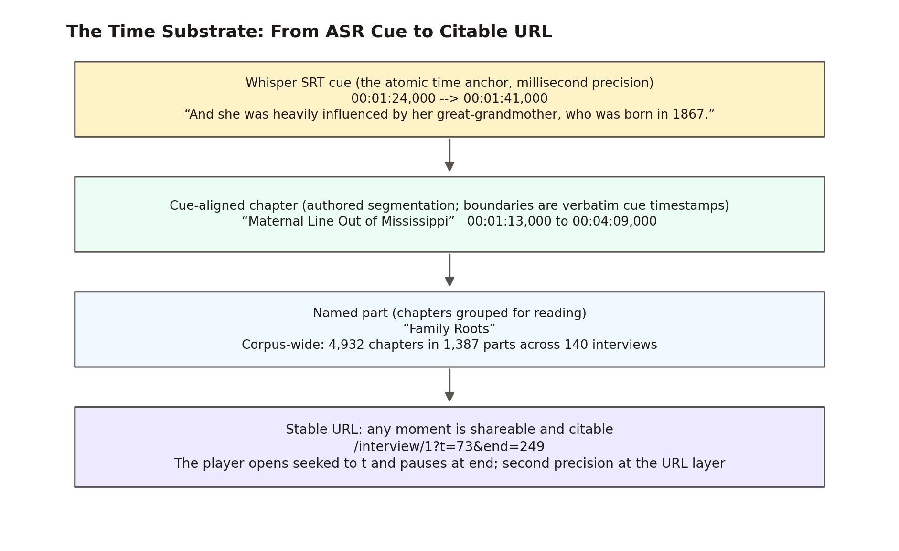
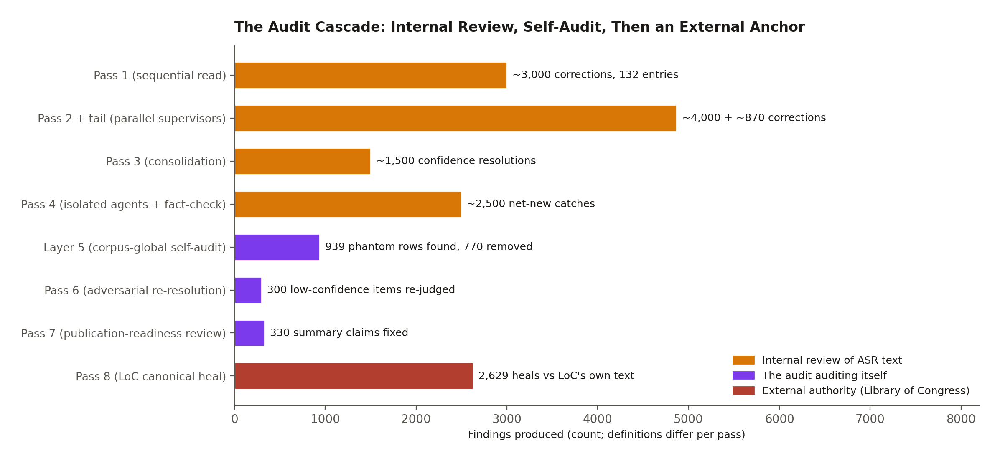
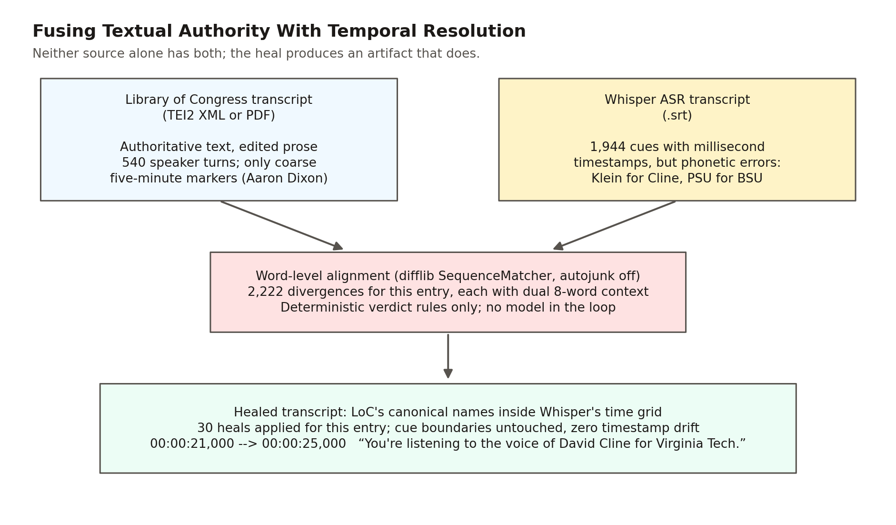
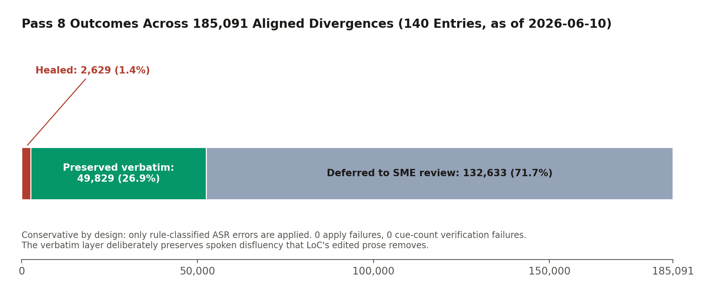
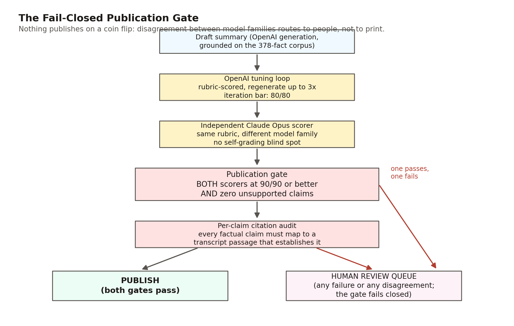
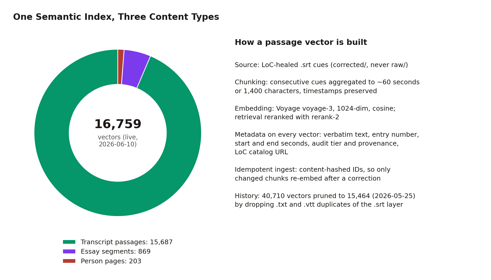
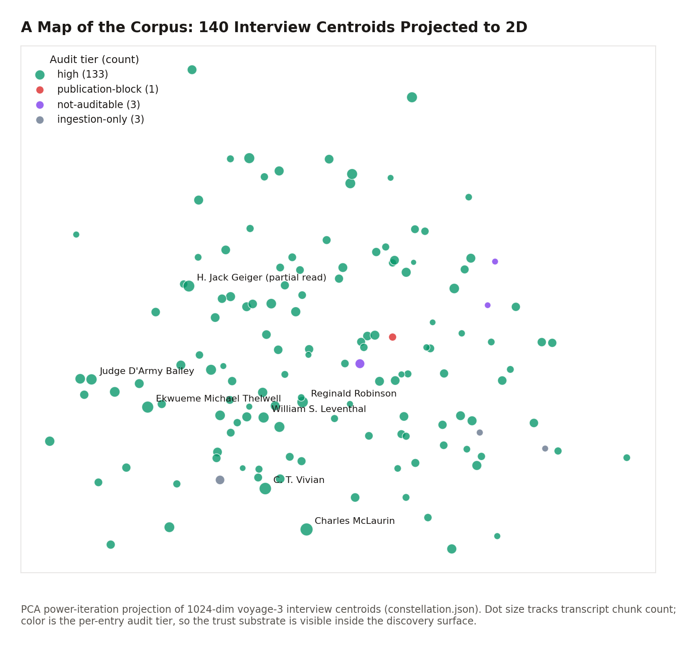
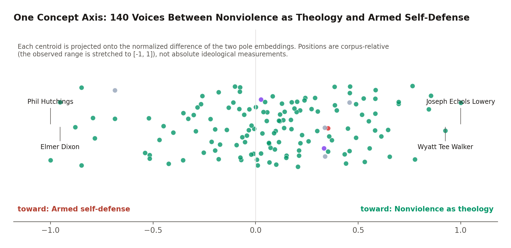
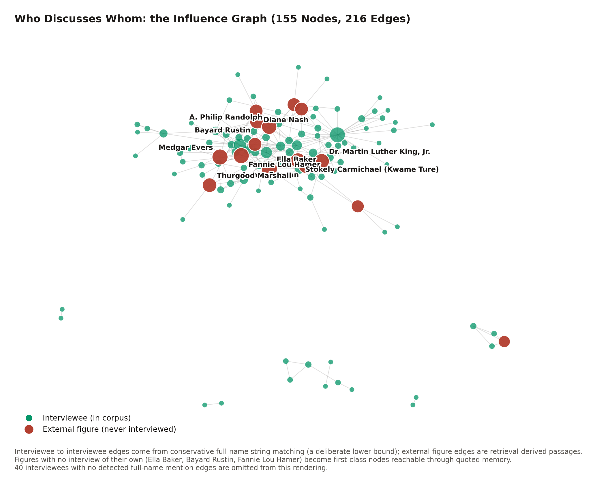

## Abstract

The Library of Congress Civil Rights History Project collection, produced with the Smithsonian National Museum of African American History and Culture, holds roughly 250 hours of oral history video: first-person testimony from the people who lived and led the American civil rights movement. The collection is public, but its legacy presentation resists exploration: an item-level catalog, a flat transcript per interview, and a multi-hour video stream with no internal index. Nothing aligns the text to the video at the level of an utterance. This paper describes the architecture of an open-source system that transforms 140 of those interviews into a time-anchored, citation-grade, semantically navigable public resource. The pipeline transcribes each interview with Whisper ASR to obtain a millisecond-resolution temporal grid, then heals the error-prone ASR text word by word against the Library's own published transcripts. The result carries both the institution's textual authority and the ASR layer's temporal resolution, an artifact neither source possessed alone. On that substrate the system builds cue-aligned chapters, a fail-closed dual-model publication gate for AI-generated metadata, a semantic retrieval index whose every audited passage carries provenance, knowledge structures computed from the embedding space, exploration surfaces in which any moment of testimony is a shareable URL, and a public Model Context Protocol server through which any AI assistant can perform citation-grade research against the archive. We describe each layer, quantify its coverage with independently verified figures, and argue that the combination enables modes of exploration and learning that legacy archive technology could not express.

*A note on the numbers. Quantitative claims in this paper were independently re-derived on June 10, 2026 against the public repository (commit `78a113f`) or a live endpoint; counts that track the growing corpus are snapshots as of that date, and earlier dates are stated where they apply. Appendix A inventories every figure with its source artifact. Archival recordings are identified in the text by their Library of Congress item identifiers, with full entries in the Works Cited.*

## 1. Introduction: The Legacy Baseline

Consider a high school student who wants to hear what marchers saw on the Edmund Pettus Bridge, a teacher assembling a lesson on Freedom Summer, or a researcher checking whether a quotation attributed to a SNCC organizer is real. Before this project, the Library of Congress presentation of the Civil Rights History Project offered each of them the same three disconnected objects per interview:

1. **A catalog record**, searchable by title and subject heading at whole-item granularity. A query like "nonviolence as theology" can at best surface a whole multi-hour item (it does, in fact, return the right interview); it cannot say where in those hours the theme appears, because the catalog indexes descriptions of interviews, not the testimony inside them.
2. **A flat transcript**, published as a PDF or TEI2 XML file. The text is authoritative and carefully edited, but it carries no machine-actionable timestamps. The most temporal structure an LoC transcript offers is a coarse editorial marker, a bracketed timecode every five minutes in the XML editions. The Aaron Dixon transcript, for example, is 540 speaker turns with 29 such markers; nothing is anchored at the level of an utterance.
3. **A multi-hour video stream** with no internal index. Finding a remembered moment means scrubbing; citing one means writing down a timecode by hand and hoping the reader can find it again.

Nothing connects these objects. The transcript cannot take you to the moment in the video where a sentence was spoken; the video cannot show you the sentence being spoken; the catalog cannot see inside either. The practical effect, across roughly 250 hours of testimony, is that the collection is public but not explorable. Only a researcher with institutional patience can use it, and nobody can cite it at the granularity at which history actually lives, the individual spoken sentence.

The thesis of this paper is an engineering claim: every capability described below reduces to making a moment of testimony **addressable** (a stable identifier you can share), **verifiable** (a citation chain back to the Library of Congress, with the system's confidence in its own text stated plainly), and **semantically reachable** (findable by meaning, not just by keyword).

The architecture achieves this with a strict division of labor (Figure 1). Deterministic, auditable mechanisms own everything that can be wrong as a matter of fact: timestamps, transcript text, citations, licenses. Generative AI is confined to the layers where it adds interpretive value, such as summaries, chapter titles, and thematic structure, and even there it works behind a fail-closed publication gate scored by two independent model families. The posture is institutional rather than experimental: the Smithsonian and the Library of Congress evaluate this work on hallucination rigor, so the bar throughout is publication grade, not demo grade.


## 2. The Corpus and Its Provenance

The corpus comprises **140 interviews** from the Library of Congress Civil Rights History Project collection (American Folklife Center, AFC 2010/039), produced in collaboration with the Smithsonian NMAAHC: roughly 250 hours of video and two million words of spoken testimony (1.98 million words in the corrected transcripts; the LoC editions of the same interviews run 2.16 million). The full LoC collection is approximately 145 items; this corpus holds the 140 with usable transcripts. Entry identifiers span 1 to 142 with two gaps, at 31 (a duplicate identifier; that interview is carried as joint entry 75) and 95 (a source directory that arrived empty), so the corpus size can never be read off the maximum identifier. One figure deserves a correction note: earlier project materials described the collection as 600 or more hours, but the collection's own time-anchored data measures roughly 250, and the documentation was corrected project-wide on June 10, 2026. This paper uses measured figures throughout.

Everything described here is open source, and the deployed site at spokenhistory.org is, for its core render path, just files: the frontend reads per-interview JSON and precomputed aggregates committed to the repository and served statically, with a vector index behind one server-side function for semantic search. The few live database sources (a movement timeline, parts of the federated search) fail soft, so the exploration surface degrades gracefully.

Two provenance populations matter throughout. The original 127 audit-able entries went through the internal audit cascade of Section 4 before the Library of Congress healing pass existed; entries onboarded after May 25, 2026 go through the streamlined deterministic pipeline of Section 6 and carry streamlined-ingestion provenance instead. Every passage the system shows a reader carries its provenance machine-readably, end to end, with one known gap recorded in Section 14: the four newest entries still carry a placeholder value on their search vectors pending a metadata backfill.

## 3. The Time Anchor: From ASR Cue to Citable URL

The foundational design decision in the system is that **a moment of testimony is identified by the tuple (entry number, start seconds, end seconds), and that tuple is a URL**:

```
/interview/<entry>?t=<startSeconds>&end=<endSeconds>
```

Everything else either produces these tuples or consumes them.

The temporal grid behind them comes from Whisper ASR (Radford et al.), which transcribed each interview into cues carrying millisecond timestamps (`00:01:24,000 --> 00:01:41,000`) at roughly five-second granularity across the recording. The SubRip `.srt` rendering is the canonical substrate; each entry's corrected directory preserves it alongside plain-text and WebVTT renderings and a provenance manifest.

Above the cues sits an authored segmentation layer. A deterministic script collapses the corrected SRT into roughly 40-second blocks whose boundary timestamps are copied verbatim from the underlying cues. A chapter specification is authored over those blocks in a supervised editorial pass (titles, topics, and summaries are model-drafted and human-reviewed), then expanded into chapters whose start and end times are the verbatim block timestamps, validated to cover every block with no gaps and no overlaps. The separation is load-bearing for the project's hallucination posture: **the language model authors chapter titles, topics, and summaries, but it never authors a timestamp.** Time anchors are deterministic all the way down to Whisper's cue boundaries.

Chapters carry a part label that groups them into named parts, so a two-and-a-half-hour interview reads as a scannable outline. Corpus-wide, the segmentation comprises **4,932 chapters in 1,387 parts across the 140 interviews**, and a static index turns every chapter into a playable clip, so the playlist system needs no database at all (Figure 2).



The last link in the chain is playback. The embedded player streams the Library of Congress's own MP4 files from `tile.loc.gov`, preserving media provenance, but bounds them: given `(t, end)` it registers the seek before any play call and begins only once data at the seek target is ready, so the network fetch range-jumps to the clip instead of buffering from time zero. The difference is not cosmetic. For a deep clip in a 1.9 GB interview file, sequential buffering would pull roughly 1.4 GB before the first frame; the bounded player pulls megabytes. When playback crosses the end mark, the player pauses once and disarms, so a curious listener can keep going.

The page and the URL stay in lockstep. Playing a chapter rewrites the address bar to that chapter's anchor; a "Copy link to this moment" control reads the live playhead and mints a second-precision link; and arriving on a deep link seeks the player, bounds the clip, and scrolls to the right section. (The deployed app is hash-routed, so absolute links take the form `spokenhistory.org/#/interview/...`; this paper uses the path form as shorthand.)

On its own, this layer collapses the citation problem for audiovisual primary sources. A quotation is no longer "somewhere in interview 17"; it is `/interview/17?t=1835&end=1975`, Charles McLaurin's chapter titled "His Father's Signature," a link that opens the Library of Congress's own recording at the quoted sentence and stops when it ends.

## 4. Bootstrapping Trust: The Internal Audit Cascade

Whisper's output reads fluently and is mostly correct, which is precisely what makes it dangerous. Its errors concentrate, categorically, in proper nouns: the names of people, places, and organizations, which is exactly where an oral history archive's institutional credibility lives. Documented examples from this corpus include the interviewer David Cline rendered as "David Klein" across 33 interviews, Martin Luther King Jr. as "Margaret the King," the Audubon Ballroom (the site of Malcolm X's assassination) as "auto bomb bar room," Stokely Carmichael as "Stoke and Carmichael" (Whisper invented a second speaker), Eldridge Cleaver as "Elders Cleaver" eight times in a single transcript, and a merged identity, "Paul Hoffman Robeson," that fused two different men named Paul into one. These are not typos a spell checker would flag. They are confident, fluent, categorical mismatches.

Between May 21 and May 25, 2026, the project ran a seven-pass internal audit cascade over the original 127 audit-able entries (Figure 3). Three properties of that cascade proved durable.

**Corrections are an overlay; raw transcripts are never edited.** Corrections accumulate as rows in a single master overlay document (12.9 MB and 66,565 lines at this writing), and a deterministic apply script replays the overlay onto the raw files to produce the corrected corpus every downstream system reads. The entire correction history is therefore reversible and re-derivable from raw input plus the overlay.

**Every correction carries row-level provenance.** A row is keyed to the pass and entry that produced it and records the claimed Whisper rendering, the canonical reading, a confidence tier, and source attribution. One tier, `speaker-originating`, marks the cases where the speaker misremembered a fact: the transcript preserves what was said, and the tier records that the divergence originates with the speaker, not the machine. A flat transcript treats every token as equally trustworthy; this vocabulary does not.

**Completeness was measured, not asserted.** Successive passes recorded their net-new yield, giving a diminishing-returns curve from which the project estimates capture rates: roughly 60% for one pass, 85% for two, 92% for three. These are first-order estimates, never validated against independent ground truth, and the audit trail records the case where prediction failed, a pre-Pass-4 saturation estimate of fewer than two new catches per entry that was overshot by a factor of ten when Pass 4 changed methodology. Nor is there a single "number of corrections"; the accounting is per definition. Roughly 14,500 rows were authored across the seven passes, 16,214 rows are parsed by the corpus-global sweep, and 6,933 corrections were applied as text edits, with most of the remainder being informational annotations.



The cascade also audited itself. A corpus-global pass fuzzy-verified that every high-confidence row's claimed Whisper rendering actually occurs in the raw transcript it cites, and found 939 phantom rows, traced mostly to parallel multi-entry supervisor agents fabricating plausible-looking patterns; 770 phantoms were physically removed, and the same root cause had already driven Pass 4 to strict one-transcript-per-agent isolation. The audit's own process failures (work left uncommitted, stale input slices, an apply step that silently skipped five entries) are documented as findings in the same trail.

The cascade's lasting products are the substrate the modern pipeline depends on: a ground-truth fact corpus (since grown to 378 entries), a 792-pattern catalog of recurring Whisper failures, and an audit canon that the healing pass treats as protected prior knowledge. Its lasting lesson is economic. The cascade cost more than a thousand dollars in model tokens, and its final pass yielded three correction rows. It is retired for new transcripts. What replaced it costs almost nothing, because it stops guessing.

## 5. The Centerpiece: Healing ASR Text Against the Library of Congress

Pass 8, the Library of Congress cross-reference, is the architectural heart of the system and the clearest illustration of its philosophy. The observation behind it is simple. The Library of Congress publishes an authoritative transcript for every interview in this corpus: institutionally edited text with no usable timestamps. The project's Whisper layer has the opposite profile: a millisecond-resolution time grid with phonetic errors on exactly the names that matter. For entry 1, the two artifacts are 540 untimed speaker turns (LoC) versus 1,944 timestamped cues (Whisper) covering the same two hours and twenty-eight minutes of speech. Neither alone supports a citation-grade, time-anchored archive. Word-level alignment of the two produces one that does (Figure 4).



The mechanism runs in three phases per entry.

**Resolve.** A resolver finds each interview's LoC item through the collection search API, scoring candidates by title and contributor name-pairs (the scoring that distinguishes Aaron Dixon from his brother Elmer Dixon, also in the collection), and downloads the published TEI2 XML transcript. Where LoC published no XML, a fallback downloads the transcript PDF and extracts its text; today's corpus splits 104 entries healed from XML and 36 from PDF. All LoC access is strictly linear, with a 1.5-second delay per request; the project treats respectful API citizenship toward the source institution as a hard operational rule. One finding worth recording for other archive projects: not one interview was audio-only. Every interview in the collection has at least a PDF transcript.

**Align and classify.** The healer flattens the SRT cues into a single word stream, recording each cue's word positions so any alignment span maps back to specific cues. It normalizes Unicode so that encoding differences never register as divergences, then aligns the two token streams with a standard sequence matcher (difflib). Every non-equal span becomes a divergence record carrying both readings, context windows from both sources, and the overlapping cue indices. A closed set of deterministic rules then classifies each divergence; **no model is called anywhere in this loop.** The only class that modifies text fires for a single capitalized token against a single capitalized token whose lowercase similarity falls in the band [0.55, 0.95): close enough to be phonetic confusion, far enough not to be mere orthography. Contractions, number renderings, brief function-word insertions, LoC's bracketed stage directions, and hyphenated false starts all classify as preserve-ours. Everything the rules cannot classify defaults to `NEEDS_SME_REVIEW` and is preserved verbatim.

One guard deserves its own paragraph. Before applying any heal, the system checks whether its own token was promoted by a prior audit pass; if so, the verdict becomes `UNCLEAR` rather than a heal. The external authority is never allowed to silently reverse a decision the audit already made deliberately, and the guard has fired in earnest. In entry 1 it protected the audit-confirmed "Madison Valley" against LoC's own transcript, which renders the place "Harrison Valley"; there the mistake runs in the opposite direction, with the external authority carrying the error. Every firing rolls up into a standing disagreements report, 710 conflicts across 114 entries, grouped for expert adjudication into four categories that themselves teach something about archival truth: genuinely different people, spelling variants, style choices, and, candidly, Whisper-error leakage into the project's own audit canon. The legacy archive has no mechanism even to detect that two authorities disagree about a name. Here the disagreement is a first-class, reviewable artifact.

**Apply, surgically.** Heals replace tokens inside existing cue boundaries only and never touch a timestamp line; the SRT writer re-emits every parsed timestamp verbatim, the WebVTT regenerates one-to-one from the healed SRT, and a verify step enforces cue-count parity between the two. Zero timestamp drift is structural, not aspirational. The temporal grid that Section 3 built everything on is invariant under text correction, which is why text fidelity and time fidelity can improve independently.

The numbers describe a conservative instrument by design (Figure 5). Across the 140-entry corpus, alignment detected 185,091 divergences. The pipeline healed 2,629 of them (1.4%), preserved 49,829 verbatim as LoC editorial smoothing or speaker disfluency, and deferred 132,633 to expert review, with zero apply failures and zero cue-count failures. The 1.4% is the design, not a shortfall. Pass 8 does not make the project's transcript match LoC's: LoC's editors expand contractions, drop the false starts, and smooth oral speech into prose, and the project preserves the verbatim spoken layer those edits erase while importing LoC's authority on the proper nouns where ASR actually fails. Scholars of oral speech get the verbatim record; citation consumers get LoC-canonical names; both inherit the same untouched time grid. Each healed entry emits a per-entry audit artifact documenting every decision, and 2,518 of the heals were backported into the master overlay so the corrected corpus still regenerates from raw input plus the overlay.



Three things changed relative to the internal cascade this replaced. The correction authority changed, from model consensus to a primary external source. The cost per entry collapsed, from a four-figure token bill to effectively free deterministic alignment. And the failure mode changed, from "plausible guess" to "preserved verbatim and flagged." For an institution evaluating AI-assisted archival work, the last is the one that matters: the pipeline is incapable of inventing a reading. The worst it can do is decline to fix one.

## 6. Industrializing Onboarding: One Command per Interview

The seven-pass cascade was a discovery process; what it discovered is codified in a master onboarding pipeline that carries a new interview from raw Whisper output to full presence on the live site in one command:

```
python transcripts/ingestion/onboard_interview.py "<Subject>_interview_<YYYYMMDD>_<HHMMSS>"
```

The pipeline runs sixteen named stages, from locating the raw transcript through healing, numbering, segmentation, assembly, search ingestion, and index rebuilds, to a final status report. Stages with durable outputs detect their own artifacts and skip work already done, so the command is idempotent: safe to interrupt, safe to re-run. Entry numbering appends after the maximum existing identifier, so the historical gaps at 31 and 95 are never reused. The healing stage reuses the Pass 8 healer verbatim; a new transcript is corrected the deterministic way on arrival, never through the retired guesswork passes. A late stage rebuilds the full derived cross-link layer of Section 9 (semantic neighbors, the constellation, concept axes, influence and event networks, the people index) in enforced dependency order, and a single failing builder warns without aborting the rest.

Two inputs are authored by a person, and the pipeline hard-stops with authoring instructions until they exist: the parts-grouped chapter specification and a two-to-three-paragraph interview summary. This is a considered position about where human judgment belongs, not an automation gap. The Smithsonian and LoC bar requires reviewable segmentation and a citation-bearing summary, so the pipeline runs everything mechanical and stops exactly where accountable authorship matters. Two corpus artifacts likewise remain editorial by choice (the guided tours and the quote rotation), and one structural step is documented as not yet scripted: a new entry joins the thematic cluster structure by nearest-centroid assignment until the clustering itself is re-run.

Format adapters cover non-Whisper input (WhisperX JSON, PDF-only, plain text), including a synthesized-timestamp fallback for text-only sources that is explicitly discouraged: it degrades per-cue timing, leaving such an interview second-class in precisely the dimension this architecture exists to provide. And when an interview is not in LoC's collection at all, the manifest records that the gold-standard correction could not run, a case the 140-entry corpus has not yet produced.

Under legacy practice, cataloging an oral history into a navigable, searchable, cross-linked form was a months-scale manual effort. Here it is minutes of compute, two short authored documents, and an audit chain a reviewer can replay end to end.

## 7. Generating Metadata Under a Fail-Closed Gate

The interpretive layer (interview summaries, chapter summaries, topics, engagement metadata) is generated by a seven-step Python pipeline. This is the one place in the system where a language model writes prose a reader will see, and it is correspondingly the most defended.

Generation is grounded before it begins. A fact-matching step scans the transcript against the project's ground-truth corpus (378 entries and 396 aliases, schema-validated), using word-boundary-anchored matching so a short alias like SCLC cannot false-match inside another word, and injects the matched facts into every generation prompt. The original quality loop then scores each draft on accuracy and quality against an 80/80 bar, regenerating up to twice. That loop's documented history is the reason the rest of the gate exists: it kept the best of three attempts even when none passed, and its scoring prompts are lenient, which let hallucinations through.

The May 2026 overhaul added three independent layers (Figure 6); the dual gate roughly doubles per-summary API cost, so it ships behind a feature flag:

- **A cross-family scorer.** Claude Opus, a different model family from the OpenAI generator, scores the final result against the identical rubric, removing the blind spot of a model family grading its own homework. Publication requires at least 90/90 from both scorers independently, plus zero unsupported claims from the Claude pass, whose taxonomy treats even an "uncertain" flag as blocking. The 80/80 tuning bar and the 90/90 publication bar are decoupled on purpose: the loop iterates at its historical threshold, then a stricter gate judges the final artifact.
- **A per-claim citation audit.** Every factual claim in a summary must map to the specific transcript passage that establishes it, with a three-way status (supported, partially supported, unsupported) and instructions against benefit of the doubt. Any non-supported claim blocks publication, and an audit that fails to run blocks publication too, with the decision path tagged so a reviewer can see that the audit errored rather than passed.
- **A human review queue.** Disagreement between the scorers is not averaged, majority-voted, or tie-broken by a third model call; it routes to a review queue carrying both scorers' full output, where a human approves, rejects, or sends back for revision, with reviewer identity and edits recorded. If the queue itself is unreachable, the not-publishable verdict stands.



The defensive engineering extends to the type level, in a pattern replicated across all three scoring modules: malformed model output is coerced rather than crashed on, and every coercion falls toward failure. A score arriving as a numeric string is recovered to its integer value; a boolean, null, or unparseable value falls to zero, which fails the 90 threshold. A gate that crashes open is not a gate; these coercions make the failure direction a design property. Two scope notes belong in any description of this system. Both scorers evaluate a 12,000-character transcript window (matched between families so the comparison is fair), not the full multi-hour transcript. And both are instructed to tolerate ASR garbling, so a summary's correct real name counts as supported when the transcript's rendering is a documented Whisper mangling of it.

## 8. The Semantic Substrate: Embeddings, Retrieval, and the Citation Payload

Everything so far makes the corpus correct and addressable; the semantic layer makes it reachable by meaning. The healed transcripts are chunked time-aware (consecutive cues aggregated to roughly 60 seconds or 1,400 characters, with start and end seconds carried on every chunk), embedded with Voyage's voyage-3 model (1,024 dimensions), and upserted into a Pinecone serverless index under cosine similarity. Vector identifiers are deterministic and content-hashed, so re-ingesting after a correction is idempotent: unchanged chunks short-circuit without an embedding call, and the index provably tracks the current correction overlay rather than a stale snapshot. Only the `.srt` layer is indexed. An early ingest that also embedded the plain-text and WebVTT renderings produced duplicate hits and timestamp-less results; the prune that enforced the SRT-only rule dropped the index from 40,710 vectors to 15,464, a 62% reduction that made every retrieval result time-anchored by construction.

A live query counts 16,759 vectors: 15,687 transcript passages, 203 person-page vectors, and 869 essay segments (the latter two populations are the subject of Section 11; the counts sum exactly to the total). Each transcript vector carries metadata designed for institutional review at answer time, with no second lookup: the verbatim passage text, entry number and interviewee, start and end seconds, the entry's audit provenance and uncertainty tier, and the Library of Congress catalog URL (Figure 7).



Retrieval is two-stage. A server-side function (which keeps the API keys out of the client bundle) embeds the query, runs a dense top-30 vector search, then reranks the candidates with a cross-encoder down to the requested top results. Two request options matter for research workflows: an entry-number scope restricts the search to one interview, and `dedupeByEntry` keeps only the best post-rerank passage per interview, over-fetching four-fold so the result is still N distinct interviews. That second option is the mechanical heart of the polyphonic research patterns of Section 12: one query, many witnesses, no synthesis.

What comes back is the system's signature object, the citation payload: the verbatim text; the entry and interviewee; the LoC item URL; start and end timestamps in both seconds and HH:MM:SS form; the provenance and uncertainty tier with a plain-English fidelity note; both retrieval scores; and a pre-formatted Chicago-style archival citation naming the collection, the American Folklife Center, the Library of Congress, and the Smithsonian NMAAHC, with the catalog URL and timestamp range. The same payload shape is emitted by the search function and the MCP server and is reconstructed from precomputed JSON by a client-side adapter: one contract, three implementations. By default, passage retrieval also filters out the person and essay populations, so content types never mix unless a surface opts in.

Cost discipline is part of the portability argument. The retrieval substrate's ceiling is on the order of 22 to 25 dollars per month at current usage; a full re-embed of the corpus costs well under a dollar; and the swap surface to a different vector store is about 200 lines of adapter. There is no chatbot anywhere in the system: every surface either reads static JSON or makes a bounded retrieval call.

## 9. Derived Knowledge Structures: What the Embedding Space Knows

The vector index supports more than search. A family of precomputed, static JSON artifacts extracts standing structure from the embedding geometry, each consumed by a visualization surface at zero runtime cost, and nearly all of them drilling down, on click, to the same citation payloads as everything else. The discovery layer never abandons the evidence layer.

The atomic representation is the entry centroid: the mean of up to 30 sampled chunk vectors per interview, normalized so cosine similarity reduces to a dot product. From centroids flow four structures:

- **The constellation** (Figure 8): a dependency-free two-dimensional projection of the 140 centroids, a literal map of the corpus with each interview colored by its audit tier, so the trust substrate is visible inside the discovery surface.
- **Entry-level neighbors:** each interview's five most similar others, with scores. The flagship example is the corpus's own family structure rediscovered by geometry: Aaron Dixon's nearest neighbor is his brother Elmer Dixon, at cosine 0.9286.
- **Concept axes** (Figure 9): for each of seven named tensions (nonviolence as theology versus armed self-defense, sacred versus secular, local versus national, and four more), an axis vector is the normalized difference between the embeddings of two long prose pole descriptions, and each interview's position is the dot product of its centroid with that axis. Positions are corpus-relative: the observed raw range is stretched to [-1, 1], so a +1 means "the most pole-A voice in this corpus," never an absolute ideological measurement.
- **Thematic clusters:** a seeded k-means (k=30) over the centroids, with cluster names authored by a model afterward. The geometry is pure math; the labels are editorial.





Below the entry level, a per-chunk precompute gives every transcript passage its five most similar passages from other interviews, with text previews, timestamps, and LoC URLs. This is lateral navigation through 250 hours of testimony at paragraph granularity: from any moment, the system knows which moments in other lives rhyme with it.

Two complementary structures are pointedly not embedding-derived. The influence graph (Figure 10) is built by conservative full-name string matching of every interviewee's name across every other transcript, plus retrieval-derived passages for fifteen external figures; last-name-only matching was rejected because surnames like Young, Long, and King are common words, so the interviewee edges intentionally undercount. Its payoff is structural: figures who were never interviewed (Ella Baker, Bayard Rustin, Fannie Lou Hamer) become first-class nodes reachable through quoted memory, the secondhand-as-primary-source pattern made navigable. The event network aggregates only the chapter metadata's explicit event tags; as its own generated note says, nothing is inferred.



A finding aid can tell you an interview exists. None of these structures has a finding-aid analog: where a voice sits among its peers, which debate it leans into, who remembers whom. The embedding space carries information the catalog never recorded, and the architecture's contribution is to surface it without ever letting it float free of citations. One caveat spans the family: centroid sampling and the projection initialization are unseeded, so regeneration reproduces the structure statistically rather than bit-identically. The shipped artifacts are the citable snapshots.

## 10. Exploration Surfaces: How a Learner Moves Through 250 Hours

The frontend's design center is the same tuple as everything else: every surface funnels into the bounded-clip player, and every unit of meaning is a URL.

**Curated structure.** A director-authored taxonomy organizes the corpus as Collection, Theme, Playlist, Video Clips: 13 themes and 95 playlists, every playlist query machine-verified non-empty against the 4,932-clip index. Playlists are auto-advancing sequences of bounded clips assembled across interviews, the juxtaposition a legacy archive could never perform: twenty voices on school desegregation, each clip playing only its own span. Lateral movement layers on top. A recommendation rail ranks the most similar interviews not already in the playlist via the entry-level neighbors; related playlists offer two same-theme siblings and one cross-theme pick; and the historic figures discussed in the playing interview link to their reference pages in a new tab, so the video never stops.

**Federated search.** A command palette (Cmd/Ctrl+K or the `/` key, mounted once at the application root so it works on every route) fans a single query out in parallel across six sources: the static people and essays catalogs, two live database collections, semantic passages, and a circuit-breaker-guarded vector arm that retires itself after two failures. Each source races its own timeout and fails soft; a dead source drops its result group and the rest render. The design rule for transcript hits is the project's epistemology in miniature: results show evidence, not prose. The reader sees the verbatim matched passage in quotation marks with a relevance score, never a model-written summary of what was found, and selecting it lands inside the bounded clip, listening.

**Reading surfaces.** The interview page leads with the video and its verification badge, renders parts and chapters as a clickable outline, accepts deep-link arrival by opening the containing part and cueing the bounded span, and mirrors the playing section back into the address bar. A K-12 curriculum generator tunes a lesson to any grade band and builds every activity from bounded primary-source clips, mirroring the selected grade into the URL so a teacher shares exactly what she sees. A transparency page explains the pipeline, the dual-scorer gate, and the LoC cross-reference, and reads its audit-tier counts live from the corpus data so its numbers cannot go stale. Accessibility is enforced at the token layer rather than per-component: a documented dual-red contrast system (the brand red fails WCAG AA for body text and is restricted to large text), a global focus outline, and reduced-motion support.

## 11. The Reference Layers: People and Essays

Two content layers extend the archive beyond the interviews, both governed by the same discipline: nothing reaches the reader without a citation chain, and the machine checks the chain.

The people catalog gives every named individual a citation-bearing reference page, 202 of them: 165 interviewees and 37 external figures. Each page leads with an `ai_reading`, a specific, embedding-derived observation (an unexpected high-cosine neighbor, an axis position that complicates the public framing), always written as what the model finds, never as historical fact. The biographical paragraph that follows anchors every factual claim with a numbered reference into a prioritized source list: LoC item pages first, then other primary-source institutional archives, scholarly references after, Wikipedia last or absent. Measured practice is stricter than the policy: of the catalog's 1,093 source entries, zero cite wikipedia.org. The pages' primary substance is 1,021 verbatim interview quotes, each carrying its entry, timestamps, audit tier, and LoC URL, and each machine-verified by a fail-closed gate requiring the quote to be a contiguous word sequence in the cited healed transcript. That gate passes 1,021 of 1,021 on a live run. A second gate cross-checks every "leans toward" claim in the prose against the sign of the page's actual concept-axis position; it currently fails, and Section 14 reports what it caught.

The essays layer reproduces period primary texts in full: the fourteen essays of Du Bois's *The Souls of Black Folk*, the seven essays of *The Negro Problem*, Anna Julia Cooper, and Ida B. Wells. Nine authors, 198,988 words, spanning 1892 to 1903, with zero AI-generated essay prose anywhere in the layer; machine editorializing on a formal archive would cast suspicion on the carefully sourced rest of the site. The controlling rule is a deterministic license gate built on one legal observation: embedding a text into a search index is a derivative use, so No-Derivatives licenses are categorically incompatible however "open" they look, while public-domain and derivative-permitting licenses qualify. The gate is data-encoded in the curation manifest and enforced by an intake script that records refusals rather than silently flipping them, and a generated provenance report lists every hosted essay with its citation, license, and canonical source. The legality of reproduction is itself an auditable artifact.

The essays are chunked into the same index as the testimony (869 segments), excluded from passage search by default and opt-in for cross-content queries. That enables a research move the legacy stack could not express: one semantic query connecting an 1895 Wells-Barnett argument to a 2011 oral-history memory, across formats and across a century.

## 12. The Archive as an API: Agentic Access Through MCP

The final access layer generalizes everything above beyond this project's own frontend. A public Model Context Protocol server exposes the archive to any MCP-compatible AI client (Claude, Codex, or anything else that speaks the protocol) at `mcp.spokenhistory.org/mcp`. It is free, read-only, and requires no login or API key; it logs request metadata but never query text; and it is rate-limited per IP as a cost guard rather than a security boundary. The service scales to zero between uses on a 256 MB instance; the marginal cost of making a national archive agent-readable is tens of dollars a month.

The surface, live-verified against the deployed endpoint, is eight tools, three prompts, and a set of grounding resources. Five primitive tools expose retrieval and the rosters; three research-pattern tools compose them into scholarly moves:

- `compare_perspectives({topic})` returns one passage per distinct interview on a topic (the dedupe mechanism of Section 8), with framing that explicitly forbids synthesis: the polyphonic record is the point.
- `trace_evolution({interviewee, topic})` resolves the name against the roster, scopes retrieval to that interview, and returns passages in chronological order.
- `source_for_claim({claim})` retrieves passages framed for SUPPORTS, COMPLICATES, or CONTRADICTS labeling against a stated claim: the quote-verification workflow as a single call.

The same three patterns are also registered as MCP prompts, because clients differ in what they route to the model, and the resources (a corpus overview, the rosters, per-entry transcripts) let an agent ground itself in the archive's actual extent and provenance before asking anything. Every passage an external AI receives carries the full citation payload of Section 8, audit tier and fidelity note included, so a third-party assistant can disclose exactly how thoroughly the transcript behind a quotation was verified, and emit a publication-ready citation, without either party trusting the other's prose.

A live smoke query during the verification pass for this paper, `search_transcripts({query: "nonviolence as theology", limit: 1, dedupe_by_entry: true})`, returned Joseph Echols Lowery, entry 66, LoC item 2015669122, timestamps 00:26:57 to 00:27:56, provenance audit-original, tier high, and the full formatted citation. The whole architecture, in one tool call.

Engineering keeps the surface trustworthy. The pure logic lives in a side-effect-free module with unit tests; the rosters are baked in at build time, with a CI drift check that fails the build if a corpus change would ship a stale roster; and deploys are push-to-deploy from the repository, so the live surface tracks the audited corpus. Legacy archives are opaque to AI agents, and agents are becoming how a meaningful share of research starts. This layer makes the archive a citable data source for that world rather than scraping fodder, with provenance attached to every sentence it hands out.

## 13. What Legacy Technology Could Not Do

Each section above ended with a capability; this section assembles them. The contrast is with the legacy presentation of the same collection (catalog records, flat PDF/XML transcripts, unindexed video), using this corpus's verified figures.

| Capability | Legacy presentation | This system |
|---|---|---|
| Find testimony by meaning | Catalog keyword search over item metadata | Semantic search over 15,687 time-anchored passages, reranked, with `dedupeByEntry` for many-voices queries |
| Address a moment | Item-level URL for a multi-hour video | `/interview/N?t=&end=` for any of 4,932 chapters, any search hit, any quote, down to the sentence |
| Verify a quotation | Read the PDF, scrub the video | 1,021 catalog quotes machine-verified verbatim against healed transcripts; any passage replays as a bounded clip from LoC's own stream |
| Trust the transcript | One unversioned text, error rate unknown and unstated | Dual-fidelity record: LoC-authoritative names inside a verbatim ASR layer, 185,091 divergences individually classified (heal, preserve verbatim, or defer to expert review), per-entry uncertainty tiers stated on every result the audit metadata covers (Section 14) |
| See structure | A finding aid listing interviews | Constellation, 7 concept axes, 30 clusters, per-passage cross-interview neighbors, an influence graph with never-interviewed figures as nodes |
| Assemble teaching material | Manual excerpting, no time anchors | 95 curated cross-interview playlists; a grade-tuned K-12 lesson generator built from bounded primary-source clips |
| Cite properly | Hand-compose from catalog metadata | Pre-formatted Chicago citation with LoC item URL and timestamp range on every payload, in the UI and over the API |
| Machine access | None; scraping | A public MCP server: 8 tools, citation-grade payloads, audit provenance on every audited passage (Section 14) |
| Institutional accountability | Trust the archive | A replayable audit chain: raw plus overlay regenerates the corpus; per-entry stage files; a standing report of every disagreement with the source institution |

The learning scenarios from Section 1 resolve concretely. The student types a question in the command palette and lands inside a bounded clip of a witness answering it, with the catalog citation one click away. The teacher opens a playlist where twenty voices take turns on Freedom Summer, or lets the curriculum generator build the lesson, and every artifact she shares is a URL that plays exactly what she vetted. The researcher hands the claim to `source_for_claim` and receives passages framed as supporting, complicating, or contradicting it, each with the timestamp, the audit tier, and the LoC item to check against. None of these interactions was expressible against the legacy stack at any price in patience, because the objects they operate on (the addressable moment, the verified quote, the polyphonic result set) did not exist.

## 14. Limitations and Residual Uncertainty

A system whose argument is honesty must be honest about itself. The limitations below are stated with the same specificity as the capabilities.

**Residual transcript error is quantified, not eliminated.** 132,633 divergences await expert review; the audit tiers exist precisely because the unreviewed tail is real. The per-entry tier distribution is 133 entries at `high` (cross-referenced line by line against the LoC published transcript), 3 `not-auditable` (inherent audio limits), 3 `ingestion-only` (the streamlined path, awaiting deeper audit), and 1 `publication-block`. The capture-rate estimates for the internal cascade (60/85/92%) are first-order extrapolations from a diminishing-returns curve, never validated against independent ground truth, and the record includes a saturation prediction that missed by a factor of ten.

**The gates fire, which is the point.** On a live run during the verification pass for this paper, the snippet gate passed 1,021 of 1,021, but the axis-label gate failed with 10 mismatches across 8 pages, all at near-zero axis positions (absolute normalized position at most 0.21), consistent with a later spectrum regeneration drifting near-center entries across the sign boundary after the prose was written. The flagged pages await re-wording or re-pinning. A reader should treat this as the verification machinery working as designed: the failure is visible, located, and bounded, rather than silent.

**Some structures lag the corpus.** Entry-level neighbors cover 136 of 140 entries pending a precompute rerun; the cluster structure predates the four newest entries, which are folded in by nearest-centroid assignment; those same four entries (139-142) carry placeholder provenance and no audit-tier metadata on their search vectors, so tier-filtered retrieval silently excludes them; recommendation rails are interview-precise, not clip-precise; and the healer stamps a hardcoded date into post-report heal records, a known bug awaiting a one-line fix. Each gap has a documented, mechanical closure path.

**Known scope boundaries.** Scoring windows truncate long transcripts at 12,000 characters; the dual gate is feature-flagged, not unconditional; retrieval is dense-only, with hybrid sparse fusion documented as future work; concept-axis positions are corpus-relative; the influence graph undercounts by design; deep-link autoplay is subject to browser gesture policy (the clip is always cued and bounded even when the browser holds playback); and `ai_reading` observations are statements about embedding geometry, not historiography. Editorial layers (guided tours, the quote rotation) remain human by choice.

**Methodological caveats for citation.** Counts in this paper carry as-of dates because the corpus grows; several project documents lag the artifacts they describe (the authoritative values are the measured ones inventoried in Appendix A); and the live vector-index totals require credentials to re-derive, so the offline reader must rely on the dated snapshots recorded here.

## 15. Conclusion

The architecture described here is, at bottom, three commitments held simultaneously. First, **time is the substrate**: a millisecond grid from ASR, preserved invariant under every later correction, makes the moment of testimony the system's atomic unit, and a URL. Second, **authority is borrowed, not asserted**: the text heals against the Library of Congress's own published transcripts through a deterministic, model-free aligner that would rather flag than guess, and every disagreement with the source institution is a reviewable artifact. Third, **generative AI is confined and gated**: models write only interpretive prose, behind a two-family 90/90 gate and per-claim citation audit that fail closed to humans, and behind the reference pages' own verbatim-quote and axis-label gates.

The result inverts the usual anxiety about AI in cultural institutions. The system does not ask the reader to trust a model; it uses models where they help and shows its work everywhere: provenance and a tier on every audited passage vector, a citation on every payload, an audit trail a reviewer can replay from raw bytes. What that rigor buys is not just safety but capability. Because every moment is addressable, the archive is shareable at the granularity of a sentence. Because the text carries institutional authority inside ASR timing, search results are simultaneously trustworthy and playable. Because structure is computed from the embedding space with its caveats stated, the corpus exhibits relationships no finding aid recorded. And because all of it is exposed through an open protocol, the same capabilities extend to every AI assistant, which is increasingly where learning begins.

The pattern is portable. Any oral history archive with a published reference transcript and recoverable audio can run the same play: transcribe for time, align for authority, heal deterministically, gate the generative layer, and address everything. The Civil Rights History Project corpus, 140 interviews and roughly two million words of testimony from the people who made the movement, now demonstrates what that unlocks: an archive that does not merely store its voices but lets anyone, human or machine, find the exact moment a voice said the thing that matters, hear it, and cite it.

## Appendix A: Verified Quantitative Inventory

Every figure in this paper, with its source artifact and verification status. "Verified 2026-06-10" means independently re-derived against the working tree at commit `78a113f` (or a live endpoint) during the adversarial verification pass for this paper.

| Figure | Value | Source | Status |
|---|---|---|---|
| Interviews in corpus | 140 (IDs 1-142, gaps at 31 and 95) | `public/rag/toc.json` (`count`, `rechaptered_count`) | Verified 2026-06-10 |
| Collection scale | ~250 hours of video (toc.json durations sum to 250.9 h; chapter coverage 239.0 h) and ~2.0M transcribed words in the 140 holdings; full LoC collection ~145 items. Earlier project docs' "600+ hours / ~5M words" could not be reconciled against measured holdings and were corrected project-wide on 2026-06-10 | `public/rag/toc.json`, corrected transcript word counts | Verified 2026-06-10 |
| Chapters / parts | 4,932 chapters in 1,387 parts | `public/rag/toc.json` sums | Verified 2026-06-10 |
| Playable clips | 4,932 (one per chapter) | `public/rag/playlist_index.json` | Verified 2026-06-10 |
| Entry 1 scale | 67 chapters, 8 parts, 8,871-second video; 21,880 our words vs 21,077 LoC; 1,944 cues vs 540 turns; 2,222 divergences, 30 heals | `entry_1.json`, `Aaron_Dixon.divergences.json` | Verified 2026-06-10 |
| Master overlay | 12.9 MB, 66,565 lines | `transcripts/CLEANED_TRANSCRIPTS_REVIEW.md` | Verified 2026-06-10 |
| Cascade row counts | ~14,500 rows authored (2026-05-25); 16,214 parsed by Layer 5; 6,933 applied | `lessons_learned.md`, `transcripts/AUDIT_TRAIL.md` | Documentary (dated) |
| Layer 5 self-audit | 939 phantom rows found; 770 removed | `transcripts/AUDIT_TRAIL.md` | Verified 2026-06-10 |
| Whisper failure catalog | 792 unique patterns | `transcripts/AUDIT_TRAIL.md` (Phase 1b) | Documentary |
| Ground-truth corpus | 378 entries, 396 aliases; validator exit 0 | `civil_rights_facts.json`, `scripts/validate_facts.py` | Verified 2026-06-10 (live run) |
| Pass 8 coverage (report) | 127/127 healed; 92 XML, 35 PDF; 0 audio-only | `transcripts/loc_healing/COVERAGE_REPORT.md` | As of 2026-05-25 |
| Pass 8 source split (current) | 104 XML, 36 PDF | `transcripts/loc_healing/divergences/` | Verified 2026-06-10 |
| Pass 8 outcomes (current corpus) | 185,091 divergences; 2,629 healed (1.4%); 49,829 preserved; 132,633 deferred; 0 apply failures; 0 cue-count failures | `transcripts/corrected/*/manifest.json`, cross-checked against divergences JSONs | Verified 2026-06-10 (two independent derivations agree exactly) |
| Auto-heal band | similarity ratio in [0.55, 0.95), single capitalized token | `heal_one_entry.py` | Verified 2026-06-10 |
| LoC API discipline | linear, 1.5 s/request | `resolve_loc_items.py`, `onboard_interview.py` | Verified 2026-06-10 |
| Audit-vs-LoC disagreements | 710 across 114 entries (report); 711 live | `AUDIT_VS_LOC_DISAGREEMENTS.md`; divergences JSONs | As of 2026-05-25 / 2026-06-10 |
| Backported P8 rows | 2,518 | master overlay row count | Verified 2026-06-10 |
| Onboarding stages | 16 named stages; hard stops at stages 8 and 9 | `onboard_interview.py` `STAGES` | Verified 2026-06-10 |
| Cascade token cost | more than $1,000 | `transcripts/ingestion/ONBOARDING_REVIEW.md` | Documentary |
| Publication gate | tuning 80/80 (3 attempts); publication 90/90 both families plus zero unsupported claims; rubric penalty 5 points per invented claim | `tuning.py`, `claude_scorer.py`, `StandardizedRubric_1.md` | Verified 2026-06-10 |
| Scoring window / review excerpt | 12,000 chars / 6,000 chars | `claude_scorer.py`, `review_queue.py` | Verified 2026-06-10 |
| Vector index (live) | 16,759 total = 15,687 passages + 203 person (202 pages + 1 stray index-derived vector) + 869 essay | Pinecone `civil-rights` live query | Verified 2026-06-10 (prefix counts sum exactly to total) |
| Prune history | 40,710 to 15,464 (-62%), 25,246 duplicates dropped | commit `3bfcc07`, `rag/shared.mjs` | Documentary (2026-05-25) |
| Chunking | ~60 s / 1,400 chars (time-aware); 1,100 chars / 180 overlap (text); ~280 words (essays) | `rag/chunker.mjs`, `rag/ingest.mjs` | Verified 2026-06-10 |
| Models | voyage-3 (1024-dim, cosine), rerank-2 | `rag/shared.mjs`, index spec | Verified 2026-06-10 |
| Retrieval defaults | topK 30, topN 8 (max 50), query cap 4,000 chars, 4x dedupe over-fetch | `netlify/functions/retrieve.mjs` | Verified 2026-06-10 |
| Infra cost | ~$22-25/month retrieval substrate; ~$0.80 budgeted full re-embed (measured ~$0.16) | `docs/RAG_SUBSTRATE_DECISION.md` (monthly); `rag/OPERATIONS.md` (re-embed) | Documentary (2026-05-22) |
| Tier distribution | high 133, not-auditable 3, ingestion-only 3, publication-block 1 | `pipeline_output/entry_*.json` | Verified 2026-06-10 |
| Centroids / constellation | 140 centroids (mean of <=30 chunks, L2-normalized); PCA power iteration | `centroids.json`, `constellation.json`, `precompute.mjs` | Verified 2026-06-10 |
| Concept axes | 7 axes, 140 positions each; nonviolence raw range [-0.0968, 0.0695]; most pole-A voice Joseph Echols Lowery | `ideological_spectrums.json` | Verified 2026-06-10 |
| Neighbors | top-5 arrays for 136 of 140 entries; Aaron Dixon to Elmer Dixon 0.9286 | `summaries/neighbors.json` | Verified 2026-06-10 |
| Clusters | k=30, seed 42, 12 restarts over 136 centroids; 140 members shipped (139-142 by nearest-centroid assignment) | `clusters.json`, `clusters_raw.json`, `precompute_clusters_neighbors.py` | Verified 2026-06-10 |
| Influence graph | 155 nodes (140 + 15 external), 216 edges | `summaries/influence.json` | Verified 2026-06-10 |
| Per-chunk related | 140 files, top-5 per chunk, cross-entry only | `public/rag/related/` | Verified 2026-06-10 |
| Event network | 67 events, 123 people, 581 edges; deterministic | `summaries/event_network.json` | Verified 2026-06-10 |
| Frontend taxonomy | 13 themes, 95 playlists, 0 empty | `src/data/archiveThemes.js` vs `playlist_index.json` | Verified 2026-06-10 |
| Federated search | 6 sources, per-source timeouts, circuit breaker at 2 failures | `src/services/federatedSearch.js` | Verified 2026-06-10 |
| People catalog | 202 pages (165 + 37); 1,021 snippets (700 self, 321 about) on 177 pages; 1,093 sources, 0 Wikipedia | `public/rag/people/*.json` | Verified 2026-06-10 |
| Snippet gate | 1,021/1,021 pass, exit 0 | `scripts/verify_person_snippets.py` | Verified 2026-06-10 (live run) |
| Axis-label gate | 10 mismatches, 8 pages, exit 1; all positions <= 0.21 absolute | `scripts/audit_axis_labels.py` | Verified 2026-06-10 (live run) |
| Essays | 23 hosted, 9 authors, 10 topics, 198,988 words; manifest 27 rows (23 hosted, 4 candidate) | `public/rag/essays/manifest.json`, `index.json`, sources report | Verified 2026-06-10 |
| Essay vectors | 869 | commit `2888a3c`; live prefix count | As of 2026-06-01 seed ingest; live-confirmed 2026-06-10 |
| MCP surface | 8 tools, 3 prompts, 4 resources + 1 template; version 0.2.0 | live `tools/list` etc. on `mcp.spokenhistory.org` | Verified 2026-06-10 (live probe) |
| MCP smoke result | entry 66 Lowery, LoC item 2015669122, 00:26:57-00:27:56, tier high, full citation | live `search_transcripts` call | Verified 2026-06-10 (live probe) |
| MCP rate limit / VM | burst 30, 1/sec refill; shared-cpu-1x 256 MB, scale-to-zero | `server.mjs`, `fly.toml` | Verified 2026-06-10 |
| MCP tests | 10/10 pass | `mcp-server/test/lib.test.mjs` (run from package dir) | Verified 2026-06-10 (live run) |

## Appendix B: Reproducibility Notes

The paper's claims can be re-derived from a checkout of the repository (`aigamma/spokenhistory.org`). Representative commands, run from the repository root:

```bash
# Corpus count and segmentation
python -c "import json; t=json.load(open('public/rag/toc.json')); \
  print(t['count'], sum(i['chapter_count'] for i in t['interviews']), \
        sum(i['part_count'] for i in t['interviews']))"

# Pass 8 outcome totals (sums over per-entry manifests)
python - <<'EOF'
import json, glob
tot = {'divergence_count':0,'healed_count':0,'preserved_verbatim_count':0,
       'unresolved_count':0,'apply_failure_count':0}
for m in glob.glob('transcripts/corrected/*/manifest.json'):
    b = json.load(open(m, encoding='utf-8')).get('loc_healing') or {}
    for k in tot: tot[k] += b.get(k, 0) or 0
print(tot)
EOF

# Ground-truth corpus validation
cd "Metadata Generation System" && python scripts/validate_facts.py

# People-catalog quote gate and axis-label gate (live oracles)
python scripts/verify_person_snippets.py
python scripts/audit_axis_labels.py

# MCP unit tests
cd mcp-server && node --test

# Regenerate this paper's figures from live repository data
python docs/figures/technical-paper/generate_figures.py
```

The governance documents that carry the full audit history are `transcripts/AUDIT_TRAIL.md` (longitudinal session log and the inferential scoring framework), `transcripts/OPEN_PROBLEMS.md` (the punch list), `transcripts/CLEANED_TRANSCRIPTS_REVIEW.md` (the correction overlay), `transcripts/loc_healing/COVERAGE_REPORT.md` and `AUDIT_VS_LOC_DISAGREEMENTS.md` (Pass 8), and the per-entry stage files under `transcripts/pass*_stage/`. The DOCX edition of this paper (Calibri, MLA page furniture with a running head and page numbers, double-spaced body, hanging-indent Works Cited) regenerates from this Markdown source, `docs/CONFERENCE_PAPER.md`, with `python docs/build_conference_paper_docx.py` (run from the repository root). The ten figures are shared with the project's standing technical reference, `docs/TECHNICAL_PAPER.md`, and regenerate from repository data via the script above, so the edition stays reproducible as the corpus grows.

*Dustin O'Hara, PhD (Principal Investigator & Project Director); Jack Sovelove (Co-Principal Investigator & Software Developer); Eric Allione (AI Engineering Lead); Sophia Zhuk (Software Developer). Produced for the Spoken History Project at the University of California, Los Angeles, under the supervision of the Library of Congress, 10 June 2026. Live site: spokenhistory.org. MCP endpoint: mcp.spokenhistory.org/mcp. Collection: Civil Rights History Project, American Folklife Center, Library of Congress, in collaboration with the Smithsonian National Museum of African American History and Culture.*

## Works Cited

"Civil Rights History Project." *American Folklife Center, Library of Congress*, www.loc.gov/collections/civil-rights-history-project/. Accessed 10 June 2026.

Cooper, Anna Julia. *A Voice from the South*. 1892. Reproduced at *Spoken History*, spokenhistory.org/#/essays.

"difflib: Helpers for Computing Deltas." *Python 3 Documentation*, Python Software Foundation, docs.python.org/3/library/difflib.html. Accessed 10 June 2026.

Dixon, Aaron. Oral history interview. *Civil Rights History Project*, American Folklife Center, Library of Congress, www.loc.gov/item/2015669186/. Accessed 10 June 2026.

Du Bois, W. E. B. *The Souls of Black Folk*. A. C. McClurg, 1903.

Lowery, Joseph Echols. Oral history interview. *Civil Rights History Project*, American Folklife Center, Library of Congress, www.loc.gov/item/2015669122/. Accessed 10 June 2026.

MacFarlane, John. *Pandoc: A Universal Document Converter*. Version 3.10, pandoc.org. Accessed 10 June 2026.

McLaurin, Charles. Oral history interview. *Civil Rights History Project*, American Folklife Center, Library of Congress, www.loc.gov/item/2016655412/. Accessed 10 June 2026.

"Model Context Protocol." *Anthropic*, modelcontextprotocol.io. Accessed 10 June 2026.

Pinecone Systems, Inc. *Pinecone Vector Database Documentation*. docs.pinecone.io. Accessed 10 June 2026.

Radford, Alec, et al. "Robust Speech Recognition via Large-Scale Weak Supervision." *arXiv*, 2022, arxiv.org/abs/2212.04356.

Spoken History Project. *spokenhistory.org repository*. GitHub, github.com/aigamma/spokenhistory.org. Accessed 10 June 2026.

Voyage AI, Inc. *Voyage AI Documentation: voyage-3 and rerank-2*. docs.voyageai.com. Accessed 10 June 2026.

Washington, Booker T., et al. *The Negro Problem*. James Pott & Company, 1903.

"Web Content Accessibility Guidelines (WCAG) 2.2." *W3C Recommendation*, World Wide Web Consortium, 2023, www.w3.org/TR/WCAG22/.

Wells-Barnett, Ida B. *The Red Record: Tabulated Statistics and Alleged Causes of Lynchings in the United States*. 1895. Reproduced at *Spoken History*, spokenhistory.org/#/essays.
